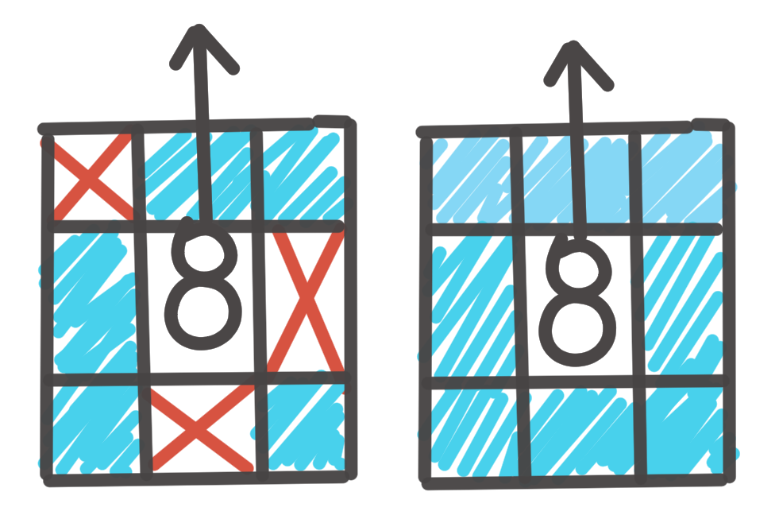
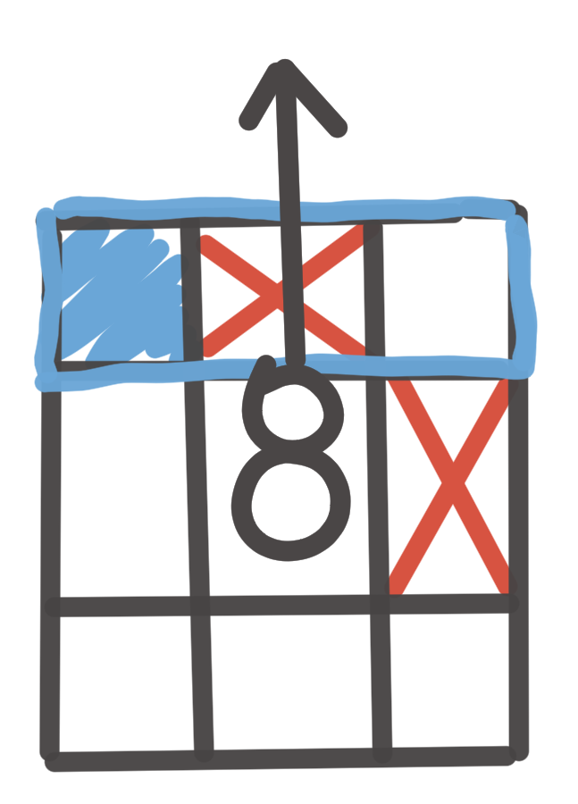

# La fonction get_cellule
### Explication globale 
La fonction get_cellule est un point clé de ce programme car elle permet à la fourmi de savoir les cases surlesquelles elle peut se déplacer. Celle-ci est par conséquent employée dans la majeur partie des programmes. Renvoie des tuples sous la forme (1, 0), (-1, 0), (0, 1) ...

### Fonctionnnement
Le code pertmet d'exclure toutes solutions possibles qui correspondent à une case en dehors de la carte sélectionnée. Elle peut être appelée selon différents modes :

* **Filtered** : Renvoie 3 cases, si non bloquées par des obstacle, en fonction de la fourmi (devant plus les diagonales de devant). Si présence d'une nourriture dans ces cases, elle ne renvoie que la direction de celle-ci

  

* **Almost All** : Renvoie toutes les cases autour de la fourmi sauf celles étant occuppées par des obstacles.

  

* **All** : Renvoie toutes les cases autour de la fourmi (8 cases). Permet de savoir si il y a des obstacles autour de la fourmi et ainsi appliquer différents comportements en fonction du programme dans lequel la fonction est appelée.

  

### Evolution 
Un autre code plus évolué de cette fonction a été élaboré mais il ne fonctionne pas correctement car il ne renvoie pas correctement les cases. L'amélioration repose sur une impossibilité de la fourmi d'aller sur une diagonale si des cases adjacentes sont bloquées par des obstacles

  

