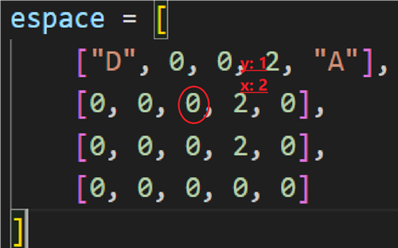
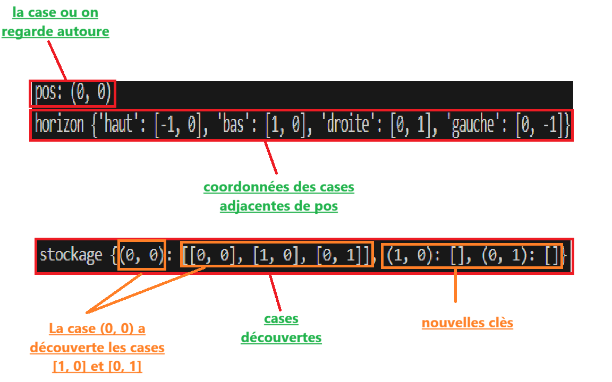
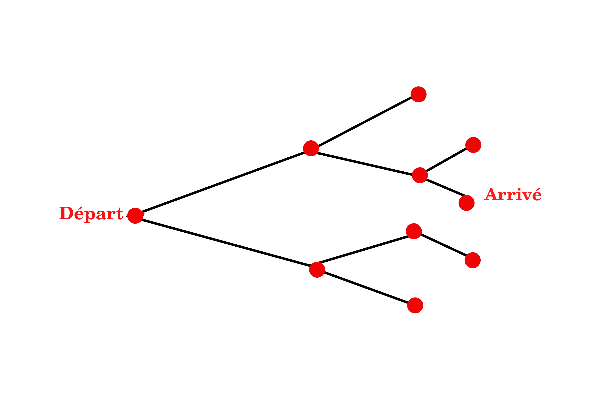

# Path findings

## Objectifs du programme

1. Savoir si une carte est *connexe* entre deux points
2. Connaître la **longueur** du plus petit chemin entre deux points

La carte est en 2d.  Les Y sont le tableau chosit et les X la position de la valeur dans le tableau :

1. Pour se déplacer nous partons du point de départ D puis nous regardons les cases adjacentes.
2. Toutes les cases adjacentes libres et non déja découverte sont charger dans un dictionnaire **stockage** dans la clé  *tuple* des coordonnée de la case que nous regardons autour *pos* *(donc coordonnée de départ au début)*
3. Nous ajoutant les clés des coordonées des cases découvertes sous forme de tuple.

 

4. Dans chaque nouvelle clés nous appliquons le même programme. Jusqu'à ce que nous trouvons les coordonnées d'arrivées.
c'est un système de tour par tour,ansi nous somme sur que le chemin trouvé est le plus court  nous ne pouvons pas redécouvrir des cases deja découverte
Stockage est comme un arbre *branches ----> liste dans les tuples   arrête ----> tuple*

5. A ce moment ,  stockage n'a pas seulement le chemin le plus court mais aussi les feuilles de l'arbre
   

6. Nous utilison alors un programme qui se déplace dans l'arbre de stockage . Il part depuis l'arrivé jusqu'au départ Il regarde qu'elle clés possède la case ciblé j'usqua la case départ.Cela permet de connaitre le chemin le plus court et et donc sa distance.
   

